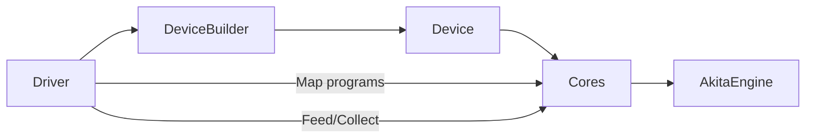
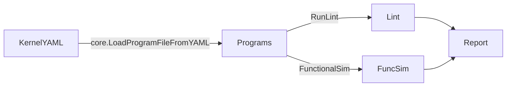

# Zeonica
Cycle-accurate CGRA / wafer-scale accelerator simulator with a fast verification toolkit.

## Overview
- Built on [Akita v4](https://github.com/sarchlab/akita) for timing-accurate simulation of CGRA tiles and interconnect.
- Driver + device builder to map kernels, feed/collect data, and configure memory topology.
- `verify/` package: static lint + functional simulator + reporting (fast semantic verification before full simulation).
- Reference kernels live in the `test/Zeonica_Testbench` submodule (AXPY, histogram, etc.).

## Requirements
- Go 1.24+ (see `go.mod` toolchain).
- Git with submodules enabled.

## Setup
```bash
git clone https://github.com/sarchlab/zeonica.git
cd zeonica
git submodule update --init --recursive   # brings in test/Zeonica_Testbench
go mod download
```

## Quick Start
### Verify a kernel (fast path)
- Library API:
```go
programs := core.LoadProgramFileFromYAML("kernel.yaml")
arch := &verify.ArchInfo{Rows: 4, Columns: 4, Topology: "mesh", HopLatency: 1, MemCapacity: 1024}
verify.GenerateReport(programs, arch, 100).SaveReportToFile("report.txt")
```
- CLI tools:
```bash
go run ./verify/cmd/verify-axpy          # outputs verification_report.txt
go run ./verify/cmd/verify-histogram     # outputs histogram_verification_report.txt
```

### Run tests
- Verify package only: `go test ./verify -v`
- Full suite (longer): `go test ./...`

## Project Layout
- `core/` — cycle-accurate CGRA core, instruction emulator, tracing utilities.
- `cgra/` — common CGRA data structures, ports, messages, device/tile interfaces.
- `api/` — driver that maps kernels, feeds/collects data, and runs the engine.
- `config/` — device builder, mesh wiring, and memory modes (simple/shared/local).
- `verify/` — lint + functional simulator + report generator; CLI under `verify/cmd/`.
- `test/` — regression tests and sample kernels; `test/Zeonica_Testbench` is a submodule with YAML kernels.

## Architecture (How it fits together)
- **Tile/Core** (`core/`): Instruction emulator + cycle-accurate send/recv paths on Akita ports; traces dataflow/memory events. Opcodes implemented in `core/emu.go`, state in `core/core.go`.
- **CGRA device** (`cgra/`, `config/`): Mesh wiring of tiles; configurable memory mode (`simple`, `shared`, `local`) via `config.DeviceBuilder`. Uses Akita direct connections and optional shared memory controllers.
- **Driver** (`api/driver.go`): Maps per-PE kernels, feeds inputs, collects outputs, and ticks the simulation engine. Supports preload/read of per-PE memory.
- **Verification fast path** (`verify/`): Static lint (STRUCT/TIMING) + functional simulator + report generator. Mirrors opcode semantics without timing/backpressure; CLIs in `verify/cmd/`.
- **Testbench** (`test/Zeonica_Testbench` submodule): Reference kernels (AXPY, histogram, etc.) consumed by verify and simulation tests.

### Execution flow (simulation)


### Execution flow (verification)


## Working with Kernels
1. Author kernel YAML (per-PE programs) under `test/Zeonica_Testbench/kernel/...`.
2. Lint + functional verify with `verify.GenerateReport` or the CLI tools.
3. For timing-accurate runs, map programs via the driver/config packages and use Akita simulation (see tests under `test/` for patterns).

## Tips & Troubleshooting
- Submodule is required for the bundled kernels; re-run `git submodule update --init --recursive` after pulling.
- Opcode semantics are implemented in `core/emu.go`; `verify` mirrors these for functional simulation.
- If adding opcodes, update `core/emu.go` and `verify/funcsim.go`, plus unit tests in `verify/`.

## License
See `LICENSE` for details.