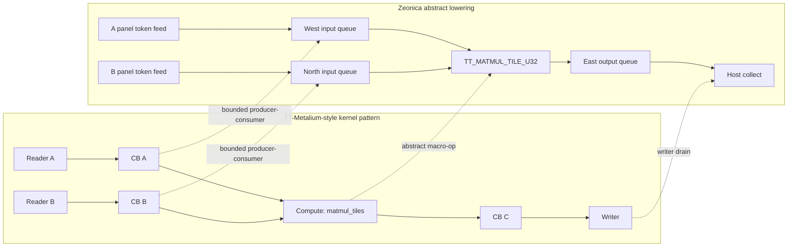
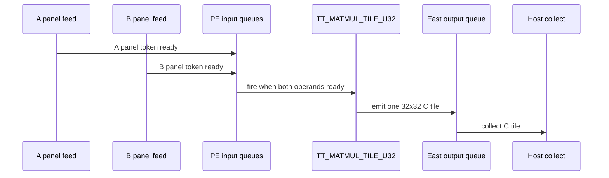

# Matmul Multicore Visuals

These figure sources summarize the strengthened Tenstorrent-inspired case
study. They are intended for paper drafts or supplementary material. The figures
show the abstract data-driven mapping only; they do not represent Wormhole
hardware datapath or timing.

## Figure 1. Kernel-Level Dataflow Mapping

**Caption.** Kernel-level lowering from the TT-Metalium-inspired
reader/circular-buffer/compute/writer pattern into Zeonica token queues and one
abstract tile-matmul macro-op. The mapping preserves data readiness and
producer-consumer dependencies, not Tenstorrent microarchitecture.

## Figure 2. Per-Output-Tile Lifecycle

**Caption.** Logical lifecycle used by the trace summary. For every output tile,
the strengthened artifact records A readiness, B readiness, abstract compute
firing, C emission, and C collection.

## Visual Table 1. 4x4 Core Partition

Each cell shows `core_id`, coordinate, and contiguous output tile range. The
demo uses 400 output tiles and assigns 25 tiles to each core.

| y \\ x | x=0 | x=1 | x=2 | x=3 |
| --- | --- | --- | --- | --- |
| y=0 | Core 0 `(0,0)` tiles `0-24` | Core 1 `(1,0)` tiles `25-49` | Core 2 `(2,0)` tiles `50-74` | Core 3 `(3,0)` tiles `75-99` |
| y=1 | Core 4 `(0,1)` tiles `100-124` | Core 5 `(1,1)` tiles `125-149` | Core 6 `(2,1)` tiles `150-174` | Core 7 `(3,1)` tiles `175-199` |
| y=2 | Core 8 `(0,2)` tiles `200-224` | Core 9 `(1,2)` tiles `225-249` | Core 10 `(2,2)` tiles `250-274` | Core 11 `(3,2)` tiles `275-299` |
| y=3 | Core 12 `(0,3)` tiles `300-324` | Core 13 `(1,3)` tiles `325-349` | Core 14 `(2,3)` tiles `350-374` | Core 15 `(3,3)` tiles `375-399` |

## Visual Table 2. Evidence Summary

| Evidence item | Value | Interpretation |
| --- | --- | --- |
| Matrix size | `M=640`, `K=640`, `N=640` | Matches the official-style full-size matmul dimensions used by the case study. |
| Tile grid | `Mt=20`, `Kt=20`, `Nt=20` | 32x32 tiles cover all matrix dimensions. |
| Output partition | 400 tiles over 16 cores | Static output-tile partition follows the source pattern at abstract level. |
| Per-core work | 25 output tiles | Balanced contiguous tile ranges. |
| Data type/layout | `uint32`, row-major flattened tiles | Deliberate abstraction, not TT bf16 or tilized layout. |
| Lifecycle coverage | 400/400 complete | Every output tile has A ready, B ready, compute, emit, and collect evidence. |
| Correctness | `mismatch=0` | Reassembled output equals CPU golden result. |

## Paper-Safe Figure Claim

These visuals support the following narrow claim:

> The case study preserves the kernel-level data-driven producer-consumer
> dependency graph of a TT-Metalium-style tiled multicore matmul after lowering
> to Zeonica.

They do not support a claim about Wormhole datapath fidelity, Tenstorrent cycle
accuracy, NoC behavior, CB microarchitecture, or performance comparability.

